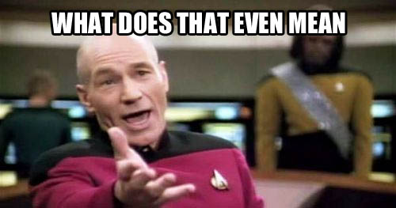

In the [previous post](/blog/tracking-changes-with-context), we discussed why it's important to add context to the application's data changes. Now we're going to see how we can do that in Elixir with Phoenix and Ecto.

## Adding context to Context



Context is an overloaded term, especially in programming. Let's see the two definitions we will be using:

**Context:**

> _1) the situation within which something exists or happens, and that can help explain it_; _2) the influences and events related to a particular event or situation_;
>
> ([Cambridge Dictionary](https://dictionary.cambridge.org/dictionary/english/context))

**(Phoenix) Context:**

> _Contexts are dedicated modules that expose and group related functionality. For example, anytime you call Elixir's standard library, be it `Logger.info/1` or `Stream.map/2`, you are accessing different contexts. Internally, Elixir's logger is made of multiple modules, but we never interact with those modules directly. We call the Logger module the context, exactly because it exposes and groups all of the logging functionality._
>
> ([Phoenix docs](https://hexdocs.pm/phoenix/contexts.html))

They mean different things but work really well together organizing and giving meaning to what can happen and why it happened. From now on I'll refer to _contexts_ with the meaning of _explaining a situation or something that happened_ as **events**.

## Cancelling an order

Following our previous example of an online shop, we have two Phoenix Contexts: `Accounts` and `Sales`. In `Accounts`, we have a `User` schema and in `Sales`, `Client` and `Order` schemas.

To cancel an order we could have a `Sales.cancel_order/1` function as simple as:

```elixir
def cancel_order(%Order{} = order) do
  order
  |> Order.changeset({status: "cancelled"})
  |> Repo.update()
end
```

## Order cancelled. But why?

To know why an order was cancelled, let's refactor the function and add the `reason` and the `user` who did it.

```elixir
def cancel_order(%Order{} = order, reason, %User{} = actor) do
  Multi.new()
  |> Multi.update(:order, Order.changeset(order, %{status: "cancelled"}))
  |> Multi.run(:audit, &cancel_order_audit(&1, &2, reason, actor))
  |> Repo.transaction()
end

defp cancel_order_audit(_repo, %{order: order}, reason, actor) do
  metadata = %{
    source: "manual",
    reason: reason
  }

  "order_cancelled"
  |> OrderAudit.event(order.id, actor.id, metadata)
  |> OrderAudit.save()
end
```

We're also using `Ecto.Multi` to make the operation atomic (it means that the event log will be saved only when the order is cancelled without errors) and added a `cancel_order_audit/4` callback function that setups the metadata and saves the changes.

The `OrderAudit` module is a standard [Ecto Schema](https://hexdocs.pm/ecto/Ecto.Schema.html), with a twist:

```elixir
defmodule AlchemyReaction.Sales.OrderAudit do
  # highlight-range{1-6}
  use AlchemyReaction.Audit,
    repo: AlchemyReaction.Repo,
    schema: __MODULE__,
    events: [
      "order_cancelled"
    ]

  use Ecto.Schema
  import Ecto.Changeset

  alias AlchemyReaction.Accounts.User
  alias AlchemyReaction.Sales.Order

  schema "orders_audit" do
    field :event, :string
    field :metadata, :map
    belongs_to :row, Order
    belongs_to :actor, User

    timestamps(updated_at: false)
  end

  @doc false
  def changeset(%__MODULE__{} = order_audit, attrs) do
    order_audit
    |> cast(attrs, [:event, :row_id, :metadata, :actor_id])
    |> validate_required([:event, :row_id, :actor_id])
  end
end
```

We are using the `Audit` module and setting some options, including the `events` list.

There's only one event, `order_cancelled`, but we could have many more: `item_removed`, `payment_type_changed`, `shipping_address_changed` and so on.

I usually have multiple audit modules inside a context, one for each _subcontext_.

**Subcontext?**


For those familiar with [DDD](https://en.wikipedia.org/wiki/Domain-driven_design), they are like [aggregate roots](https://martinfowler.com/bliki/DDD_Aggregate.html).

The `Order` schema is composed of other smaller schemas that make no sense existing outside it, like order items and payments. So the `Order` _aggregates_ this additional data, and as the most important one, it is the _root_, hence _Aggregate Root_. But I like to call them _subcontexts_ because the terminology is closer to Phoenix Contexts. :)

Can you come with another good candidate for a sub context in `Sales` context?

**IMPORTANT:** a sub context is an internal concept and should only be interacted with from its parent context. In this example, all calls from outside will still happen to `Sales` context.

_Caveat: an Ecto schema should be a simple mapping between a data source and an Elixir struct, but I couldn't find a better place for this example. In my actual application I organize my contexts a little different so this doesn't happen. I'll write about it in the future._

## The `Audit` module

So what is it? How does it work?


Here's the full code:

```elixir
defmodule AlchemyReaction.Audit do
  require Logger

  defmacro __using__(opts) do
    repo = Keyword.fetch!(opts, :repo)
    schema = Keyword.fetch!(opts, :schema)
    events = Keyword.fetch!(opts, :events)

    if Enum.empty?(events), do: raise(ArgumentError, message: "event list empty")

    save_function =
      quote do
        # Output:
        #
        # def save(%Ecto.Changeset{} = changes) do
        #   AlchemyReaction.Audit.save(changes, repo)
        # end
        def save(%Ecto.Changeset{} = changes) do
          unquote(__MODULE__).save(changes, unquote(repo))
        end
      end

    event_signature =
      quote do
        def event(event, row_id, actor_id, metadata \\ nil)
      end

    event_log_functions =
      for event_name <- events do
        quote do
          # Output:
          #
          # def event("foo_event", row_id, actor_id, metadata) do
          #   AlchemyReaction.Audit.event(schema, "foo_event", row_id, actor_id, metadata)
          # end
          def event(unquote(event_name), row_id, actor_id, metadata) do
            unquote(__MODULE__).event(
              unquote(schema),
              unquote(event_name),
              row_id,
              actor_id,
              metadata
            )
          end
        end
      end

    [save_function, event_signature, event_log_functions]
  end

  @doc """
  Saves the event to the `Repo`.

  In case nothing changed, simply does nothing.

  It returns `{:ok, :no_changes}` if nothing changed, `{:ok, struct}` if the log
  has ben successfully saved or `{:error, changeset}` in case of error.
  """
  @spec save(Ecto.Changeset.t() | :no_changes, Ecto.Repo.t()) ::
          {:ok, :no_changes}
          | {:ok, Ecto.Schema.t()}
          | {:error, Ecto.Changeset.t()}

  def save(:no_changes, _repo) do
    {:ok, :no_changes}
  end

  def save(%Ecto.Changeset{} = changes, repo) do
    Logger.debug("Saving audit info...")
    repo.insert(changes)
  end

  @doc """
  Creates a `schema` changeset for the `event` identified by `row_id` and caused
  by `actor_id`.

  The given `metadata` can be either `nil`, `Ecto.Changeset`, struct or map.

  It returns `:no_changes` in case of an `Ecto.Changeset` metadata that changed nothing
  or an `Ecto.Changeset` with the event ready to be inserted.
  """
  @spec event(Ecto.Schema.t(), String.t(), non_neg_integer(), non_neg_integer(), Ecto.Changeset.t() | struct() | map() | nil) ::
          :no_changes | Ecto.Changeset.t()

  def event(schema, event, row_id, actor_id, metadata \\ nil)

  def event(_, _, _, _, %Ecto.Changeset{changes: changes} = _changeset)
      when map_size(changes) == 0 do
    :no_changes
  end

  def event(schema, event, row_id, actor_id, %Ecto.Changeset{} = changeset) do
    metadata = %{
      before: Map.take(changeset.data, Map.keys(changeset.changes)),
      after: changeset.changes
    }

    audit_changeset(schema, event, row_id, actor_id, metadata)
  end

  def event(schema, event, row_id, actor_id, %_{} = struct) do
    metadata =
      struct
      |> Map.from_struct()
      |> Map.drop([:__meta__])

    audit_changeset(schema, event, row_id, actor_id, metadata)
  end

  def event(schema, event, row_id, actor_id, metadata) when is_map(metadata) do
    audit_changeset(schema, event, row_id, actor_id, metadata)
  end

  defp audit_changeset(schema, event, row_id, actor_id, metadata) do
    schema
    |> struct()
    |> schema.changeset(%{
      event: event,
      row_id: row_id,
      actor_id: actor_id,
      metadata: metadata
    })
  end
end
```

Using this module defines a pair of `event/3` and `event/4` functions for each listed event, helping you avoid typing out a wrong event name thanks to pattern matching. The difference between them is the `metadata` parameter. Most events will need additional metadata, but some of them don't, the event name alone is sufficient to describe what happened.

A `save/1` function is also defined. To save the event log. For real. Except when there's nothing to save because nothing changed. But saves most times...

The `event/3` and `event/4` functions delegate the calls to the `event/5` inside the `Audit` module itself that creates the log changeset. Thanks to pattern matching again the `metadata` can be built from different sources:

- an `Ecto.Changeset`: the changes and their original values are extracted in a `%{before: %{}, after: %{}}` map; or it returns a `:no_changes` atom in case nothing changed. The latter bypasses saving so it doesn't create a useless log entry
- a `struct`: all fields from the struct are added to the metadata
- a `map`: anything you need to contextualize the event. Take care to put only what's necessary, adding too little or too much hinders your ability to see what happened clearly

At first, it may seem too much work to manually create the callback functions and build the events, but it pays off. The event log gives you multiple benefits: you can show the changes in a timeline, store changes over time for accountability reasons, have traceability of changes for security, an much more.

I'm using this in one of my applications and it's been a blast.
